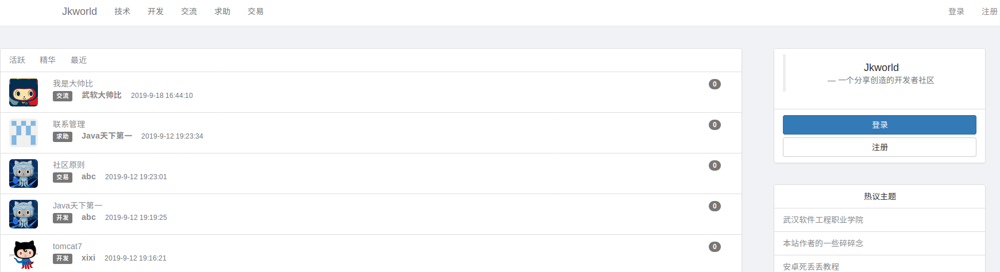
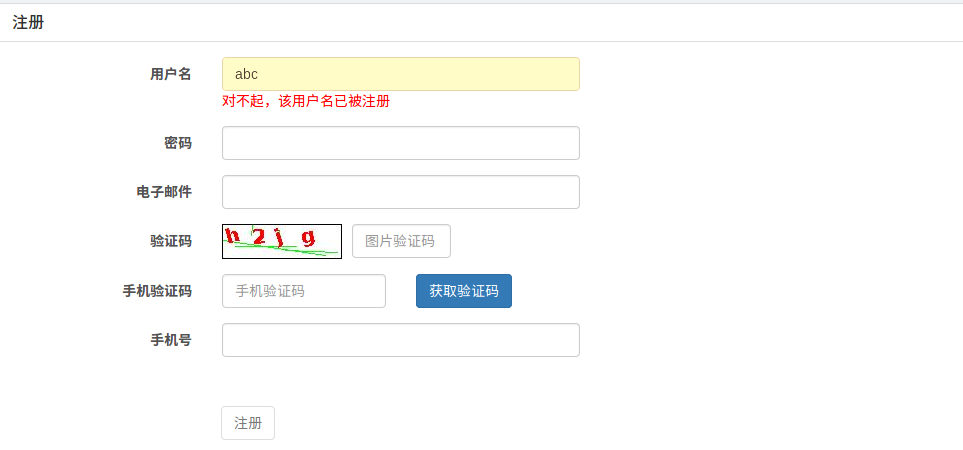
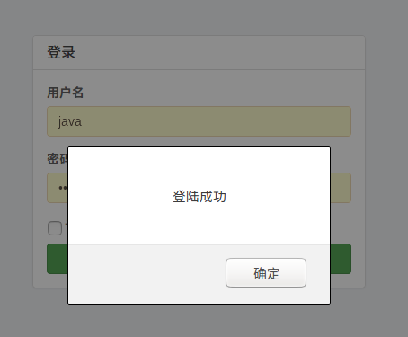
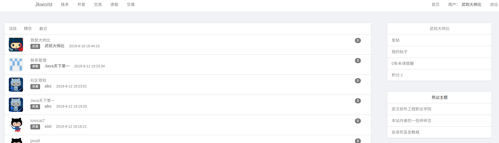
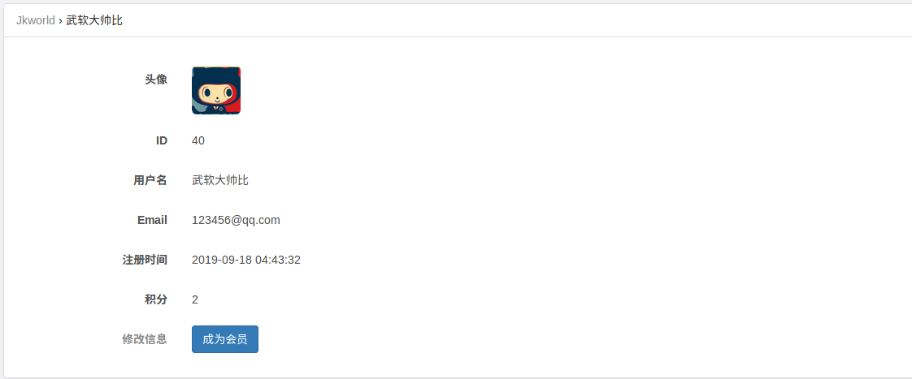
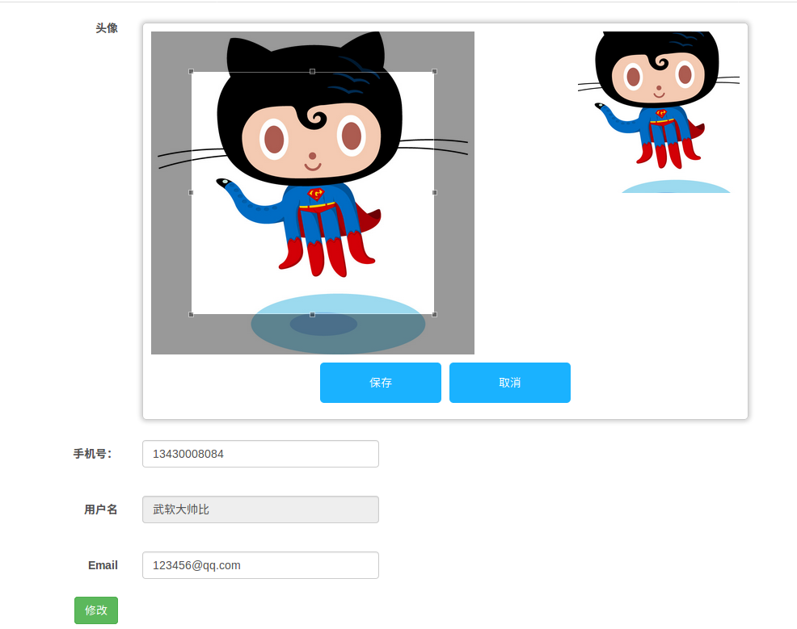
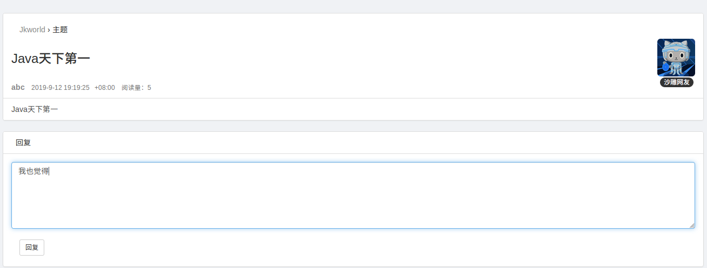

# microBlog
一个集成了SSM+Shiro的博客系统

项目以发布到服务器上 http://www.whrjzxd.club/microBlog/  各位同学可以去看看～

架构：

​			使用Spring+SpringMVC+Mybatis+Shiro

环境：

​			Idea+Maven3.6+MySQL 5.7+Tomcat7

交流：

​			QQ号码1013171543

​			遇到项目部署出现问题的同学，可以加我QQ问我，大家一起学习，一起进步QAQ

## 项目特点：

​				集成aliyun短信API，对用户进行手机验证注册。

​				集成Jcrop的插件，实现用户头像剪切。

​				使用pagehelper分页，减少分页代码。

## 功能模块：

### 主页（未登录）

### 注册（ajax检测用户名是否被注册）

### 登录

### 登录后的首页

### 查看个人信息

### 修改个人信息

### 查看帖子

## 附aliyun 短信API地址

https://market.aliyun.com/products/57126001/cmapi030182.html?spm=5176.2020520132.101.7.1f7c7218FumOmR#sku=yuncode2418200001

